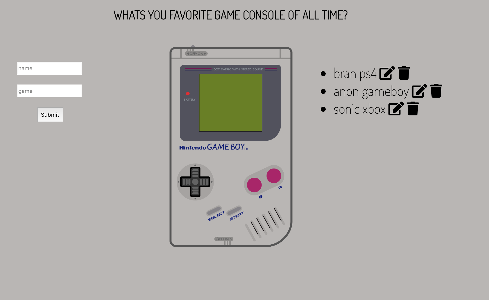

Installation:
Clone repo
run npm install

Usage:
run npm run todo
Navigate to localhost:3000

Tech Used: HTML, CSS, Node.JS, Express, MongoDB, Javascript

This application lets you post, update, and delete your favorite game console. While building this application I focused on understanding how to use CRUD, Express, and how to connect the front end to the back. That connection is made using express modules, node, mongodb, and the server localhost 3000.
